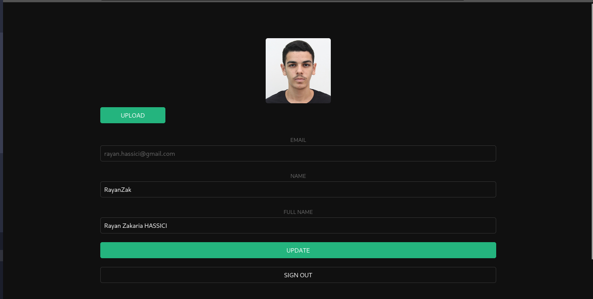

# Supabase Workshop

- Quick workshop to introduce supabase
- Project inspired by the [official Documentation](https://supabase.com/docs/guides/getting-started/tutorials/with-react?database-method=sql)

- Slides [link](https://docs.google.com/presentation/d/1BFAaGYSvgKdOC5dF8OK7IIzwNB-oSxL26SldHt87D3I/edit?usp=sharing)




## How to run?:

- **Clone the repository** 
```
git clone https://github.com/RayanZaki/Supabase_workshop.git
cd Supabase_workshop/
```
- **Open the directory with your text editor ( vscode )**
```
code .
```

- **Install dependencies and run the project**
```
npm install
cd supabase-react/
npm run dev
```
